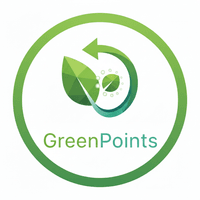

# 🌱 GreenPoints - Gamificación del Reciclaje

[](https://opensource.org/licenses/MIT)
[](https://www.php.net/)
[](https://getbootstrap.com/)
[](https://github.com/tu-usuario/Proyecto-2-DAW)



## 📖 Tabla de Contenidos

- [Descripción](#-descripción-del-proyecto)
- [Características](#-características-principales)
- [Arquitectura](#-arquitectura-del-proyecto)
- [Base de Datos](#-base-de-datos)
- [Tecnologías](#-tecnologías-utilizadas)
- [Instalación](#-instalación-y-configuración)
- [Uso](#-uso-de-la-aplicación)
- [Desarrollo](#-proceso-de-desarrollo)
- [Seguridad](#-seguridad-y-mejores-prácticas)
- [Contribución](#-contribución)

---

## 📋 Descripción del Proyecto

**GreenPoints** es una aplicación web interactiva diseñada para incentivar el reciclaje mediante un sistema de gamificación. La plataforma permite a los usuarios registrar sus actividades de reciclaje, acumular puntos, competir en rankings y canjear recompensas, todo con el objetivo de promover prácticas sostenibles y conciencia ambiental.

### 🎯 Objetivos Principales

-   🌿 **Concienciación Ambiental**: Educar sobre el impacto positivo del reciclaje.
-   🎮 **Gamificación**: Uso de rankings y recompensas para fomentar la participación.
-   🤝 **Comunidad**: Crear una red de usuarios comprometidos.
-   📊 **Impacto Medible**: Estadísticas en tiempo real de materiales y CO₂.

---

## 🚀 Características Principales

### ✨ Funcionalidades Implementadas

-   👤 **Sistema de Usuarios**: Registro, inicio de sesión seguro (Bcrypt) y perfiles con puntos.
-   ♻️ **Registro de Reciclaje**: Gestión de materiales (plástico, papel, vidrio, metal) con cálculo automático de puntos.
-   📍 **Centros de Reciclaje**: Directorio de puntos de recogida con horarios y tipos de residuos.
-   🏆 **Ranking Global**: Clasificación periódica de usuarios por rendimiento ambiental.
-   📱 **Interfaz UX/UI**: Diseño moderno, responsivo y fluido con Bootstrap 5 y animaciones.

---

## 🏗️ Arquitectura del Proyecto

El proyecto sigue el patrón de diseño **MVC (Modelo-Vista-Controlador)** para garantizar la escalabilidad y mantenibilidad.

```text
Proyecto-2-DAW/
├── app/
│   ├── controllers/      # Lógica de negocio (Usuario, Centro, Registro, Ranking)
│   ├── helpers/          # Utilidades (CsrfHelper, Sesiones)
│   ├── models/           # Interacción con la base de datos (En desarrollo)
│   └── views/            # Interfaz de usuario (Home, Login, Register)
│       └── partials/     # Componentes reutilizables (Header, Footer)
├── config/
│   └── database.php      # Configuración de conexión (soporta variables de entorno)
├── public/               # Punto de entrada público
│   ├── css/              # Estilos personalizados
│   ├── js/               # Scripts JavaScript
│   ├── img/              # Recursos visuales
│   └── index.php         # Front Controller
├── sql/
│   └── greenpoints.sql   # Esquema de la base de datos
├── INSTALL.md            # Guía detallada de instalación
└── README.md             # Documentación principal
```

---

## 🗄️ Base de Datos

La base de datos `greenpoints` utiliza un diseño relacional optimizado:

-   **usuario**: Datos personales, credenciales (hash) y puntos acumulados.
-   **centro_reciclaje**: Ubicaciones y tipos de materiales aceptados.
-   **registro_reciclaje**: Historial de depósitos y puntos ganados.
-   **ranking**: Períodos de competición.
-   **detalle_ranking**: Instantáneas de posiciones y puntos.

---

## 🛠️ Tecnologías Utilizadas

| Categoría | Tecnologías |
| :--- | :--- |
| **Backend** |   |
| **Frontend** |     |
| **Librerías** | `Animate.css`, `Bootstrap Icons`, `Google Fonts (Poppins)` |
| **Herramientas** |   |

---

## 📦 Instalación y Configuración

> Para una guía detallada, consulta [INSTALL.md](./INSTALL.md).

### Resumen Rápido:

1.  **Clonar repositorio**:
    ```bash
    git clone https://github.com/tu-usuario/Proyecto-2-DAW.git
    ```
2.  **Base de datos**:
    Importa `sql/greenpoints.sql` en tu MySQL.
3.  **Configuración**:
    Crea un archivo `.env` o edita `config/database.php`.
4.  **Ejecutar**:
    ```bash
    cd public
    php -S localhost:8000
    ```

---

## 🎮 Uso de la Aplicación

### Credenciales de Prueba
-   **Admin**: `admin@greenpoints.com` / `admin123`
-   **Usuario**: `usuario@ejemplo.com` / `user123` (si está en el SQL)

### Flujo Principal
1.  **Registro/Login** para acceder al panel.
2.  **Registrar reciclaje** para ganar puntos.
3.  **Explorar centros** para encontrar lugares cercanos.
4.  **Consultar ranking** para ver tu progreso.

---

## 🔄 Proceso de Desarrollo

-   [x] **Fase 1**: Diseño y Planificación.
-   [x] **Fase 2**: Arquitectura MVC y Enrutamiento.
-   [x] **Fase 3**: CRUD Base y Autenticación.
-   [ ] **Fase 4**: Panel de Usuario y Estadísticas.
-   [ ] **Fase 5**: Sistema de Recompensas e Insignias.
-   [ ] **Fase 6**: Testing, Seguridad y Despliegue.

---

## 🛡️ Seguridad y Mejores Prácticas

Hemos implementado varias medidas para garantizar la robustez:

-   ✅ **Protección CSRF**: Uso de tokens en formularios críticos.
-   ✅ **Hashing de Contraseñas**: Implementación de `password_hash()` con Bcrypt.
-   ✅ **Gestión de Sesiones**: Control seguro de acceso de usuarios.
-   ✅ **Variables de Entorno**: Configuración desacoplada para mayor seguridad.
-   🚧 **Validación**: Limpieza de inputs y sentencias preparadas (PDO/MySQLi).

---

## 🤝 Contribución

1.  Haz un **Fork** del proyecto.
2.  Crea una rama (`git checkout -b feature/MejoraX`).
3.  Haz un **Commit** de tus cambios.
4.  Haz un **Push** a la rama.
5.  Abre un **Pull Request**.

---

## 👥 Equipo

-   **Adrian Sempere Serrano / Diego Mario Ralcef** - [GitHub](https://github.com/tu-usuario)

---

<p align="center">
  <strong>💚 Hecho por un planeta más sostenible 🌍</strong>
</p>
