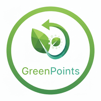

# GreenPoints - Gamificación del Reciclaje

[](https://opensource.org/licenses/MIT)
[](https://www.php.net/)
[](https://getbootstrap.com/)
[](https://github.com/tu-usuario/Proyecto-2-DAW)

<p align="center">
  
</p>

## 📖 Tabla de Contenidos

- [Descripción](#descripción-del-proyecto)
- [Características](#características-principales)
- [Arquitectura](#arquitectura-del-proyecto)
- [Base de Datos](#base-de-datos)
- [Tecnologías](#tecnologías-utilizadas)
- [Instalación](#instalación-y-configuración)
- [Uso](#uso-de-la-aplicación)
- [Desarrollo](#proceso-de-desarrollo)
- [Seguridad](#seguridad-y-mejores-prácticas)
- [Contribución](#contribución)

---

## 📋 Descripción del Proyecto

**GreenPoints** es una aplicación web cuya finalidad es fomentar el reciclaje a través de una mecánica de puntos y clasificaciones. Los usuarios pueden anotar sus actividades de reciclaje, ver su posición en un ranking y acceder a información sobre centros de recogida. En esta iteración el servidor ofrece únicamente APIs JSON; la interfaz en el navegador, construida con HTML, CSS y JavaScript, se encarga de la mayor parte de la experiencia de usuario. El uso de PHP se limita a operaciones de datos y seguridad.

### Objetivos principales

-   Concienciar sobre el impacto del reciclaje.
-   Ofrecer una experiencia de gamificación mediante rankings y recompensas.
-   Favorecer la formación de una comunidad de usuarios.
-   Proporcionar estadísticas sobre materiales reciclados y reducción de emisiones.

---

## 🚀 Características Principales

### Funcionalidades implementadas

-   API de usuarios: registro, acceso y cierre de sesión mediante peticiones JSON.
-   Registro de reciclaje: formulario que envía datos al servidor y actualiza el saldo de puntos.
-   Listado de centros de reciclaje: obtenido dinámicamente y, en su caso, creación por administradores.
-   Ranking global: visualizado en una tabla y ordenado por puntos acumulados.
-   Interfaz responsive construida con Bootstrap 5 y animaciones sencillas.
-   Navegación dinámica que reduce recargas de página.

---

## 🏗️ Arquitectura del Proyecto

La versión actual del proyecto apuesta por la **máxima simplicidad en PHP** y traslada la mayor parte de la lógica al navegador mediante APIs RESTful y JavaScript moderno. Gracias a esta estrategia el backend sólo expone rutas JSON y casi toda la interacción se realiza en `public/js/*`, manteniendo el mismo aspecto visual.

```text
Proyecto-2-DAW/
├── app/
│   ├── helpers/          # Utilidades (CsrfHelper, Sesiones)
│   └── views/            # Interfaz de usuario (HTML estático + componentes)
│       └── partials/     # Header, Footer, etc.
├── config/
│   └── database.php      # Conexión MySQL (variables de entorno opcionales)
├── public/               # Punto de entrada público
│   ├── api/              # Endpoints JSON (usuarios, registro, centros, ranking)
│   ├── css/              # Estilos personalizados (Bootstrap + custom)
│   ├── js/               # Lógica de cliente (fetch, validaciones, UI)
│   ├── img/              # Recursos visuales
│   └── index.php         # Enrutador mínimo que incluye vistas
├── sql/
│   └── greenpoints.sql   # Esquema de la base de datos
├── INSTALL.md            # Guía de instalación
└── README.md             # Documentación principal
```

---

## 🗄️ Base de Datos

La base de datos `greenpoints` utiliza un diseño relacional optimizado:

-   **usuario**: Datos personales, credenciales (hash) y puntos acumulados.
-   **centro_reciclaje**: Ubicaciones y tipos de materiales aceptados.
-   **registro_reciclaje**: Historial de depósitos y puntos ganados.
-   **ranking**: Períodos de competición.
-   **detalle_ranking**: Instantáneas de posiciones y puntos.

---

## 🛠️ Tecnologías Utilizadas

| Categoría | Tecnologías |
| :--- | :--- |
| **Backend** |   |
| **Frontend** |     |
| **Librerías** | `Animate.css`, `Bootstrap Icons`, `Google Fonts (Poppins)` |
| **Herramientas** |   |

---

## 📦 Instalación y Configuración

> Para una guía detallada, consulta [INSTALL.md](./INSTALL.md).

### Resumen Rápido:

1.  **Clonar repositorio**:
    ```bash
    git clone https://github.com/tu-usuario/Proyecto-2-DAW.git
    ```
2.  **Base de datos**:
    Importa `sql/greenpoints.sql` en tu MySQL.
3.  **Configuración**:
    Crea un archivo `.env` o edita `config/database.php`.
4.  **Ejecutar**:
    ```bash
    cd public
    php -S localhost:8000
    ```

---

## 🎮 Uso de la Aplicación

### Credenciales de Prueba
-   **Admin**: `admin@greenpoints.com` / `admin123`
-   **Usuario**: `usuario@ejemplo.com` / `user123` (si está en el SQL)

### Flujo Principal
1.  **Registro/Login** para acceder al panel.
2.  **Registrar reciclaje** para ganar puntos.
3.  **Explorar centros** para encontrar lugares cercanos.
4.  **Consultar ranking** para ver tu progreso.

---

## 🔄 Proceso de Desarrollo

-   [x] **Fase 1**: Diseño y Planificación.
-   [x] **Fase 2**: Arquitectura MVC y Enrutamiento.
-   [x] **Fase 3**: CRUD Base y Autenticación.
-   [ ] **Fase 4**: Panel de Usuario y Estadísticas.
-   [ ] **Fase 5**: Sistema de Recompensas e Insignias.
-   [ ] **Fase 6**: Testing, Seguridad y Despliegue.

---

## 🛡️ Seguridad y Mejores Prácticas

Aunque el backend está reducido a APIs, la seguridad sigue siendo fundamental:

-   ✅ **Protección CSRF**: Cada formulario incluye un token generado por `CsrfHelper`; las APIs lo verifican antes de procesar.
-   ✅ **Hashing de Contraseñas**: `password_hash()` con Bcrypt protege las credenciales en la base de datos.
-   ✅ **Gestión de Sesiones**: El inicio de sesión regenera ID y guarda sólo lo necesario (`usuario_id`, nombre, puntos, rol).
-   ✅ **Validación híbrida**: Se realizan comprobaciones en el cliente para buena UX y en el servidor para seguridad.
-   🔐 **Preparadas/parametrizadas**: Todas las consultas MySQL utilizan `prepare()` para evitar inyecciones.
-   🌍 **Entorno flexible**: Configuración a través de `config/database.php` o variables de entorno según despliegue.
-   📦 **Mínimo PHP expuesto**: Al no haber lógica de presentación en el servidor, el riesgo de fugas se reduce.

---

## 🤝 Contribución

1.  Haz un **Fork** del proyecto.
2.  Crea una rama (`git checkout -b feature/MejoraX`).
3.  Haz un **Commit** de tus cambios.
4.  Haz un **Push** a la rama.
5.  Abre un **Pull Request**.

---

## 👥 Equipo

-   **Adrian Sempere Serrano** - [GitHub](https://github.com/tu-usuario)

---

<p align="center">
  <strong>💚 Hecho por un planeta más sostenible 🌍</strong>
</p>
